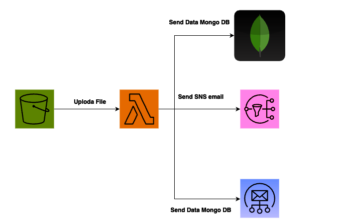

# Challenge Lambda Function in Go

This project contains a simple AWS Lambda function written in Go.

## Prerequisites

- Go installed on your system (version 1.13+)
- AWS CLI configured with appropriate permissions

## Build & Package the Application

### 1. Download Dependencies

First, initialize the Go module and download the necessary dependencies:

```bash
go mod init challenge
go mod tidy
```

This will create the `go.mod` and `go.sum` files and download all the dependencies.

### 2. Build the Application

Create the distribution directory and build the application for a Linux environment with ARM64 architecture (required for AWS Lambda):

```bash
mkdir -p dist
env GOOS=linux GOARCH=arm64 CGO_ENABLED=0 go build -tags lambda.norpc -ldflags="-s -w" -o ./dist/bootstrap main.go
```

- `GOOS=linux`: Ensures the binary is built for a Linux environment.
- `GOARCH=arm64`: Specifies the ARM64 architecture (you can change to `amd64` if needed).
- `CGO_ENABLED=0`: Disables CGO to ensure the build is compatible with Lambda's environment.
- `-tags lambda.norpc`: Optional flag to avoid including RPC code.
- `-ldflags="-s -w"`: Minimizes binary size by stripping debug information.

### 3. Change Execution Permissions

Make the output binary (`bootstrap`) executable:

```bash
chmod +x ./dist/bootstrap
```

### 4. Package the Application

AWS Lambda only accepts zipped files for uploading. Package the binary into a zip file:

```bash
cd ./dist && zip -r bootstrap.zip bootstrap ../templates && cd ..
```

The output should show something like:

```bash
updating: bootstrap (deflated 69%)
updating: ../templates/ (stored 0%)
updating: ../templates/email_template.html (deflated 69%)
updating: ../templates/email_template.txt (deflated 45%)
```

This will create a `bootstrap.zip` file in the `dist` directory, ready to be uploaded to AWS Lambda.

### 5. Upload to AWS Lambda


## Conclusion

Now your Go-based Lambda function is built, packaged, and ready for deployment to AWS Lambda.

# Architecture
## AWS Lambda
The project runs as an AWS Lambda function, triggered whenever a new file is uploaded to a designated S3 bucket. The Lambda function reads the file from S3, processes it based on its type (either JSON or CSV), and stores the processed data in MongoDB.

## S3 Integration
AWS S3 is used to store the files that will be processed. The Lambda function is triggered by an S3 event whenever a new file is uploaded. The function retrieves the file, detects its format, and processes it using the appropriate strategy.

## MongoDB Integration
The processed data from the JSON or CSV files is stored in a MongoDB database. The MongoDB Go driver is used to establish the connection and store the data. Each file upload is stored as a document in MongoDB, containing details such as the upload date and the transactions extracted from the file.

## Strategy Pattern
The Strategy Pattern is employed to separate file processing logic from the core Lambda handler. This enables the system to support multiple file formats (JSON, CSV) by defining different strategies for each. If additional file formats (e.g., XML, Excel) are needed in the future, new strategies can be added without modifying the core logic.

### Context: 
The ProcessorContext class decides which strategy to use based on the file type (JSON or CSV).
### Strategy Interface: 
The ProcessorStrategy interface defines the structure for file processing strategies.
### Concrete Strategies: 
JSONProcessor and CSVProcessor implement the file-specific logic for processing JSON and CSV files, respectively.

## SES Integration
Amazon Simple Email Service (SES) is used to send email notifications about the results of the file processing. Once the file has been processed and the data has been stored in MongoDB, an email is sent to the user to notify them of the successful processing of their file. The email contains details about the transactions and financial summary extracted from the file.

The email can be sent in both HTML and plain text formats, with support for dynamic content such as the user's name, transaction details, and financial summary.

### Sending Email with SES:
SES is integrated using the AWS SDK for Go.
The Lambda function uses SES to send a notification email to the user once the file processing is completed.
Email templates include placeholders for file details, transactions, and the financial summary.
## SNS Integration
Amazon Simple Notification Service (SNS) is used to send general notifications about the file processing.

# Diagram Architecture


